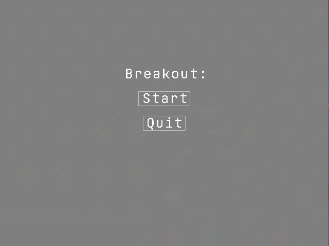

# WireBreakout

A Breakout clone rendered in wireframe using [SlimEngine++](https://github.com/HardCoreCodin/SlimEngineCpp)  

  

Controls:
* Left Arrow or 'A' : Slide paddle left
* Right Arrow or 'D' : Slide paddle right
* Up Arrow or 'W' : Launch the ball (if close to the paddle)
* SpaceBar : Pause/Unpause the game
* Escape : Quite the game

When the game is paused, a perspective camra allows for f322 3D nabigation of the scene, and has 2 modes:  
1. FPS navigation (WASD + mouse look + zooming) 
2. DCC application (default) 

  

Double clicking the `left mouse button` anywhere within the window toggles between these 2 modes.<btr>

Entering FPS mode captures the mouse movement for the window and hides the cursor. 
Navigation is then as in a typical first-person game (plus lateral movement and zooming): 

Move the `mouse` to freely look around (even if the cursor would leave the window border) 
Scroll the `mouse wheel` to zoom in and out (changes the field of view of the perspective) 
Hold `W` to move forward 
Hold `S` to move backward 
Hold `A` to move left 
Hold `D` to move right 
Hold `R` to move up 
Hold `F` to move down 
